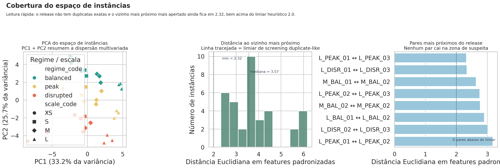

# Agro Yard D-FJSP GO Benchmark

Release oficial publicada neste repositório: `v1.1.0-observed`

Este repositório contém um benchmark sintético de **Dynamic Flexible Job Shop Scheduling** orientado ao contexto de pátio agroindustrial em Goiás. A release atual preserva a estrutura central do benchmark original e adiciona uma camada observacional mais plausível para prazos e tempos de processamento, mantendo carregamento, auditabilidade e rastreabilidade.

## Nota sobre originalidade

Este `README.md` foi escrito especificamente para este projeto. Quando a documentação fala em release "derivada", isso descreve a **linhagem do dataset** em relação à `v1.0.0`, não a origem do texto. A documentação desta base é original do repositório; a linhagem formal vale para os dados e seus metadados.

## O que esta base entrega

| Item | Valor |
| --- | --- |
| Total de instâncias | `36` |
| Escalas | `XS`, `S`, `M`, `L` |
| Regimes | `balanced`, `peak`, `disrupted` |
| Réplicas por combinação escala x regime | `3` |
| Jobs por instância | de `18` a `96` |
| Máquinas por instância | de `5` a `13` |
| Operações por job | `4` obrigatórias |
| Horizonte de planejamento | `1080` min |
| Papel oficial da release | dataset pai congelado para geração com `G2MILP` |

Cada job segue a mesma cadeia operacional:

1. `WEIGH_IN`
2. `SAMPLE_CLASSIFY`
3. `UNLOAD`
4. `WEIGH_OUT`

Cada instância já inclui:

- estrutura completa do problema
- elegibilidade por máquina
- precedências
- indisponibilidades de máquina
- eventos cronológicos
- baseline FIFO
- métricas agregadas por job
- trilhas de auditoria da camada observacional

## O que muda na `v1.1.0-observed`

Os dois campos centrais alterados nesta release são:

- `jobs.csv::completion_due_min`
- `eligible_machines.csv::proc_time_min`

Após essa transformação, também foram recalculados:

- `fifo_schedule.csv`
- `fifo_job_metrics.csv`
- `fifo_summary.json`
- `catalog/benchmark_catalog.csv`
- `catalog/instance_family_summary.csv`

O que foi preservado:

- o conjunto oficial de `36` instâncias
- a estrutura com `4` operações por job
- as precedências lineares
- a elegibilidade estrutural de máquina por operação
- a compatibilidade por commodity
- as janelas de indisponibilidade
- os eventos `JOB_VISIBLE`, `JOB_ARRIVAL`, `MACHINE_DOWN` e `MACHINE_UP`
- a interface de consumo pelo loader em `gurobi/load_instance.py`

Leitura correta: esta base continua sendo **sintética**. O ganho metodológico aqui não é "virar dado real", e sim sair de um benchmark excessivamente limpo para um seed mais útil em testes de robustez, comparação de métodos e geração de instâncias-filhas com linhagem explícita.

## Estrutura do repositório

```text
.
├── catalog/                    # catálogos agregados, manifestos e relatórios de validação
├── docs/                       # documentação metodológica da camada observacional e do contrato G2MILP
├── gurobi/                     # loader, views para modelagem e exemplo mínimo com Gurobi
├── instances/                  # 36 instâncias oficiais
├── output/jupyter-notebook/    # notebook de validação e artefatos analíticos
├── tools/                      # scripts de validação, análise e smoke tests
├── manifest.json               # manifesto global da release
└── README.md
```

## Conteúdo de cada instância

Arquivos centrais:

- `params.json`: metadados da instância, horizonte, unidades e sementes relevantes
- `jobs.csv`: atributos dos jobs, chegada, visibilidade, prioridade, prazo e custo de espera
- `operations.csv`: estágios e releases exógenos por operação
- `precedences.csv`: arcos de precedência e lags mínimos
- `eligible_machines.csv`: elegibilidade e `proc_time_min` por tripla `(job, op, machine)`
- `machine_downtimes.csv`: indisponibilidades de máquina
- `events.csv`: eventos cronológicos para replay ou análise orientada a eventos
- `fifo_schedule.csv`: baseline FIFO/earliest-completion
- `fifo_job_metrics.csv`: métricas por job derivadas do baseline
- `fifo_summary.json`: resumo agregado do baseline

Arquivos de auditabilidade da camada observacional:

- `job_noise_audit.csv`
- `proc_noise_audit.csv`
- `job_congestion_proxy.csv`
- `noise_manifest.json`

O dicionário de esquema consolidado está em `catalog/schema_dictionary.csv`.

## Catálogo da base

O arquivo `catalog/benchmark_catalog.csv` resume cada instância com escala, regime, semente, tamanho, baseline FIFO e trilha de solver sugerida.

Resumo prático por escala:

| Escala | Jobs típicos | Máquinas | Trilha sugerida |
| --- | ---: | ---: | --- |
| `XS` | `18-24` | `5` | `exact` |
| `S` | `30-40` | `7` | `exact` |
| `M` | `48-64` | `9` | `hybrid` |
| `L` | `72-96` | `13` | `metaheuristic` |

O resumo por família escala x regime está em `catalog/instance_family_summary.csv`.

## Requisitos

Dependências mínimas por tipo de uso:

| Uso | Dependências |
| --- | --- |
| Ler instâncias com o loader | Python padrão |
| Validar a release | `pandas`, `numpy` |
| Rodar smoke test exato | `pandas`, `numpy`, `scipy` |
| Rodar exemplo com Gurobi | `gurobipy` |
| Reabrir notebook | `jupyter` |

Exemplo de instalação para exploração e validação:

```bash
python -m pip install pandas numpy scipy jupyter
```

Se você quiser testar o exemplo em Gurobi:

```bash
python -m pip install gurobipy
```

## Uso rápido

### 1. Validar a release observada

```bash
python tools/validate_observed_release.py .
python tools/validate_benchmark.py
```

O primeiro script verifica consistência estrutural e emite diagnósticos globais. O segundo garante que todas as instâncias continuam carregáveis pelo stack de leitura do benchmark.

### 2. Carregar uma instância

```bash
python gurobi/load_instance.py instances/GO_XS_BALANCED_01
```

Ou, em Python:

```python
from pathlib import Path

from gurobi.load_instance import build_gurobi_views, load_instance

raw = load_instance(Path("instances/GO_XS_BALANCED_01"))
data = build_gurobi_views(raw)

print(data["params"]["instance_id"])
print(len(data["J"]), "jobs")
print(len(data["M"]), "machines")
print(len(data["ELIGIBLE_KEYS"]), "tripletas elegíveis")
```

### 3. Montar um modelo mínimo com Gurobi

```bash
python gurobi/example_usage.py
```

Esse comando requer `gurobipy` instalado. O exemplo constrói variáveis de atribuição, início e conclusão sobre a instância `GO_XS_BALANCED_01`, mas deixa a formulação de não sobreposição aberta para o usuário.

### 4. Rodar o smoke test orientado a solver

```bash
python tools/exact_solver_smoke.py
```

Esse script usa `scipy.optimize.milp` como backend leve para mostrar que:

- casos pequenos fecham no orçamento definido
- casos maiores continuam informativos e com gap não trivial sob o mesmo budget

## Validação e diagnósticos desta release

Os checks estruturais principais reportados para a release oficial são:

- `36/36` instâncias com `PASS` em `tools/validate_observed_release.py`
- todos os jobs continuam com `4` operações e `3` precedências
- toda operação continua com pelo menos uma máquina elegível
- todo prazo observado continua respeitando `job_noise_audit.csv::nominal_processing_lb_min + 18`
- o baseline FIFO permanece sem overlap por máquina
- `fifo_job_metrics.csv` continua reconciliado com `fifo_schedule.csv`
- `job_noise_audit.csv` e `proc_noise_audit.csv` continuam batendo exatamente com os arquivos centrais observados

Os diagnósticos globais divulgados pelo validador são:

- `R²(due slack ~ priority) = 0.4848`
- `R²(proc UNLOAD ~ load + machine + moisture) = 0.4995`

No notebook de validação adicional, os principais resultados consolidados foram:

- `structural_pass_rate = 1.0000`
- `release_consistency_checks_pass = True`
- `relational_consistency_checks_pass = True`
- `fifo_schema_checks_pass = True`
- `due_audit_match_share = 1.0000`
- `proc_audit_match_share = 1.0000`
- `flow_regime_checks_pass = True`
- `mean_queue_regime_checks_pass = True`
- `mean_congestion_regime_checks_pass = False`
- `instance_space_exact_duplicate_checks_pass = True`
- `instance_space_duplicate_like_checks_pass = True`
- `instance_space_nearest_neighbor_distance_min = 2.3228`
- `solver_smoke_small_cases_optimal = True`
- `solver_smoke_all_cases_have_solution = True`
- `solver_smoke_large_cases_show_non_trivial_gap = True`
- `solver_smoke_gap_ladder_pass = True`

Importante: os flags `False` acima aparecem em diagnósticos auxiliares de monotonicidade e cauda. Eles não invalidam a release, mas sinalizam exatamente onde o benchmark ainda pode ser refinado metodologicamente.

O resumo completo do notebook está em `output/jupyter-notebook/instance_validation_analysis_artifacts/notebook_summary.md`.

## Artefatos principais

Documentação:

- `manifest.json`
- `docs/README.md`
- `docs/observed_noise_model.md`
- `docs/g2milp_generation_contract.md`
- `docs/synthetic_data_validation_next_steps.md`
- `catalog/observed_noise_manifest.json`
- `catalog/noise_diagnostics_before_after.json`
- `catalog/validation_report_observed.csv`

Análise adicional:

- `output/jupyter-notebook/instance-validation-and-exploratory-analysis.ipynb`
- `output/jupyter-notebook/instance_validation_analysis_artifacts/notebook_summary.csv`
- `output/jupyter-notebook/instance_validation_analysis_artifacts/structural_report.csv`
- `output/jupyter-notebook/instance_validation_analysis_artifacts/fifo_schema_report.csv`
- `output/jupyter-notebook/instance_validation_analysis_artifacts/release_consistency_report.csv`
- `output/jupyter-notebook/instance_validation_analysis_artifacts/relational_consistency_report.csv`
- `output/jupyter-notebook/instance_validation_analysis_artifacts/instance_space_summary.csv`
- `output/jupyter-notebook/instance_validation_analysis_artifacts/solver_smoke_summary.csv`

Figuras de referência:




## Documentação metodológica

A documentação canônica versionada da release é a declarada em `manifest.json::documentation_files` e resumida em `docs/README.md`.

Para detalhes sobre a transformação observacional, consulte:

- `docs/observed_noise_model.md`
- `tools/create_observed_noise_layer.py`

Para uso desta release como dataset pai congelado em geração futura, consulte:

- `docs/g2milp_generation_contract.md`
- `manifest.json`

Para backlog metodológico de validação e fortalecimento do benchmark, consulte:

- `docs/synthetic_data_validation_next_steps.md`

## Uso metodológico correto

Esta release deve ser usada como:

- benchmark sintético com camada observacional mais realista
- base pai congelada para geração de instâncias-filhas com `G2MILP`
- referência auditável para comparação de modelos, heurísticas e pipelines de geração

Esta release não deve ser usada como:

- substituto de dado operacional bruto
- evidência de autenticidade empírica sem validação externa
- release a ser sobrescrita sem nova versionagem formal

## Próximos passos naturais

Alguns caminhos metodologicamente fortes para evoluir a base:

- validação com holdout real, se houver acesso a subconjunto confiável
- separação explícita entre `fidelity`, `diversity` e `authenticity`
- avaliação downstream com protocolos como `TSTR/TRTS`
- instance space analysis mais diretamente orientada a solver
- geração de famílias-filhas mais graduais e mais discriminantes
