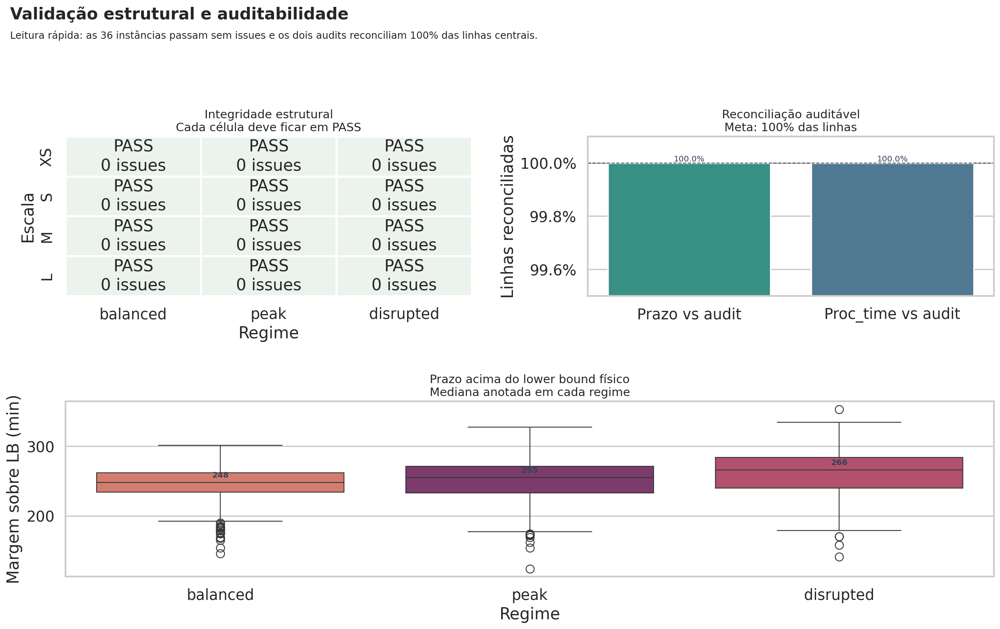
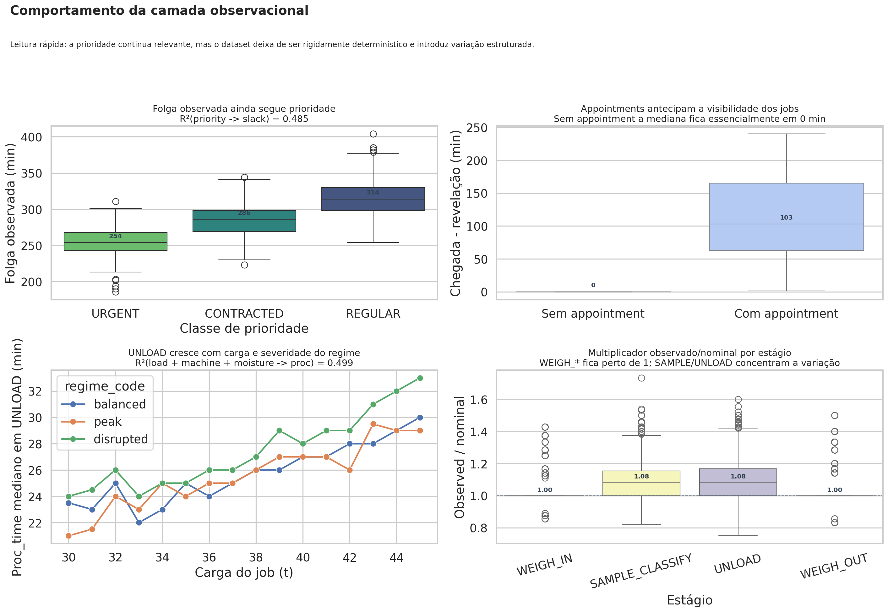
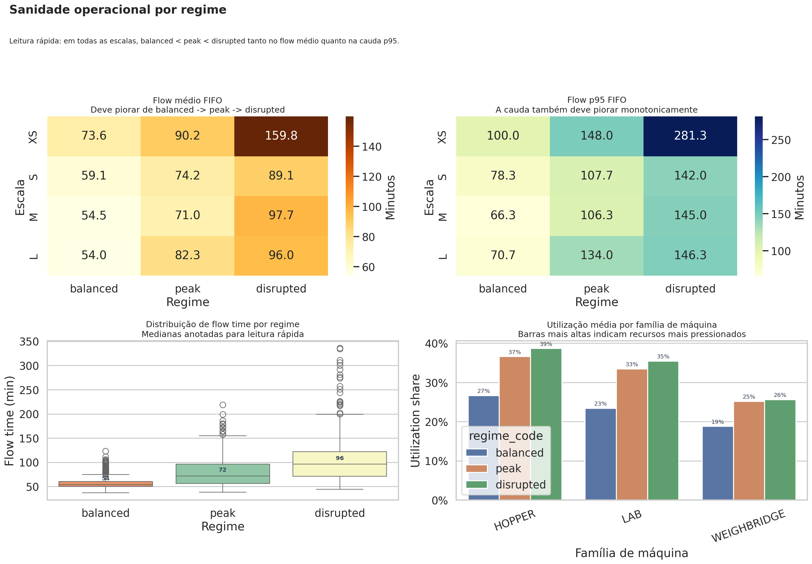
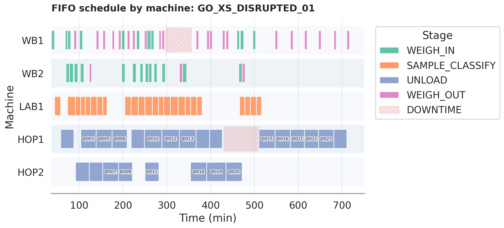

# Agro Yard D-FJSP GO Benchmark v1.1.0-observed

Esta é a release oficial do benchmark em sua forma **observada**. Ela foi derivada do release nominal `v1.0.0` com **ChatGPT 5.4 PRO**, auditada e revalidada localmente, e deve ser tratada como o **dataset seed oficial** para futuras gerações com modelos da família **G2MILP**.

## O que muda

Os únicos campos centrais alterados foram:

- `jobs.csv::completion_due_min`
- `eligible_machines.csv::proc_time_min`

Depois disso, foram recalculados:

- `fifo_schedule.csv`
- `fifo_job_metrics.csv`
- `fifo_summary.json`
- `catalog/benchmark_catalog.csv`
- `catalog/instance_family_summary.csv`

## O que foi preservado

- as mesmas `36` instâncias
- exatamente `4` operações por job
- as precedências estruturais
- a elegibilidade estrutural de máquina por operação
- a compatibilidade por commodity
- as janelas de indisponibilidade de máquina
- os eventos de chegada e visibilidade
- a interface de consumo do benchmark pelo stack Gurobi

Em outras palavras: o problema continua sendo o mesmo benchmark D-FJSP; o que mudou foi a camada observacional dos prazos e dos tempos de processamento.

## Fórmulas usadas

### 1. Prazo observado por job

$$
\mathrm{slack}^{obs}_j = b(\mathrm{priority}_j) + f(\mathrm{appointment}_j,\mathrm{commodity}_j,\mathrm{moisture}_j,\mathrm{shift}_j,\mathrm{regime}) + u_{\mathrm{inst}} + u_{\mathrm{shift}(j)} + \varepsilon_j
$$

$$
\mathrm{due}^{obs}_j = \mathrm{arrival}_j + \mathrm{clip}\!\left(\mathrm{slack}^{obs}_j,\, LB_j + 18,\, b(\mathrm{priority}_j) + 120\right)
$$

Onde:

- $b(\mathrm{priority}_j)$ é a folga base por classe de prioridade
- $f(\cdot)$ agrega efeitos fixos pequenos e interpretáveis
- $u_{\mathrm{inst}}$ é um efeito latente da instância
- $u_{\mathrm{shift}(j)}$ é um efeito latente do turno
- $\varepsilon_j$ é ruído Student-t com escala dependente do regime
- $LB_j$ é o lower bound físico plausível do job, calculado como a soma dos menores tempos elegíveis de suas quatro operações

### 2. Tempo observado por tripla `(job, op, machine)`

$$
p^{obs}_{jom} = \max\!\left( p^{\min}_{\mathrm{stage}}, \mathrm{round}\!\left( p^{nom}_{jom} \cdot \exp\!\left( u_m + u_{\mathrm{shift}} + u_{\mathrm{stage,inst}} + u_{\mathrm{regime}} + \beta_{\mathrm{stage}} \, g_j + u_{\mathrm{commodity}} + u_{\mathrm{moisture}} + \varepsilon_{jom} \right) + \mathrm{pause}_{jom} \right) \right)
$$

Onde:

- $p^{nom}_{jom}$ é o tempo nominal original
- $u_m$ é um efeito persistente da máquina
- $u_{\mathrm{shift}}$ é um efeito do turno
- $u_{\mathrm{stage,inst}}$ é um efeito latente do estágio na instância
- $u_{\mathrm{regime}}$ captura o ambiente `balanced / peak / disrupted`
- $g_j$ é o proxy contínuo de congestionamento derivado das chegadas
- $u_{\mathrm{commodity}}$ e $u_{\mathrm{moisture}}$ são ajustes semânticos pequenos
- $\varepsilon_{jom}$ é ruído idiossincrático
- $\mathrm{pause}_{jom}$ representa microparadas ocasionais
- $p^{\min}_{\mathrm{stage}}$ impõe um piso por estágio

## Como validamos

### 1. Integridade estrutural

Rodamos:

```bash
python tools/validate_observed_release.py .
```

Resultado da release oficial:

- `36/36` instâncias com `PASS`
- todo job tem `4` operações
- todo job tem `3` precedências estruturais
- toda operação tem ao menos uma máquina elegível
- todo prazo respeita `completion_due_min - arrival_time_min >= nominal_lb + 18`
- cada job tem exatamente `1` evento `JOB_VISIBLE`
- cada job tem exatamente `1` evento `JOB_ARRIVAL`
- não há overlap de máquina no baseline FIFO
- `end_min - start_min` bate com `eligible_machines.csv::proc_time_min`
- `fifo_job_metrics.csv` bate com `fifo_schedule.csv`

### 2. Validação do loader Gurobi

Rodamos:

```bash
python tools/validate_benchmark.py
python gurobi/load_instance.py instances/GO_XS_BALANCED_01
```

Isso garante que:

- a instância continua carregável pelo loader
- toda `machine_id` referenciada existe em `machines.csv`
- todo `proc_time_min` é positivo
- todo par `(job_id, op_seq)` continua com elegibilidade válida

### 3. Reconciliação dos audits

A release só é aceitável se:

- `job_noise_audit.csv::completion_due_observed_min == jobs.csv::completion_due_min`
- `proc_noise_audit.csv::proc_time_observed_min == eligible_machines.csv::proc_time_min`

### 4. Diagnósticos de realismo

Os diagnósticos agregados da release foram:

- `R²(due slack ~ priority): 1.0000 -> 0.4848`
- `R²(proc UNLOAD ~ load + machine + moisture): 0.7540 -> 0.4995`

Além disso, a ordem operacional esperada foi preservada:

- `balanced < peak < disrupted` em `avg_fifo_mean_flow_min`
- `balanced < peak < disrupted` em `avg_fifo_p95_flow_min`

## Resultados do notebook

O notebook `output/jupyter-notebook/instance-validation-and-exploratory-analysis.ipynb` gerou uma camada adicional de testes, estatísticas e figuras sobre as `36` instâncias oficiais.

Resumo dos resultados agregados:

- `structural_pass_rate = 1.0000`
- `fifo_schema_checks_pass = True`
- `due_audit_match_share = 1.0000`
- `proc_audit_match_share = 1.0000`
- `flow_regime_order_checks_pass = True`
- `queue_regime_order_checks_pass = True`
- `congestion_mean_regime_order_checks_pass = False`
- soma total de mismatches em eventos: `0` para `JOB_VISIBLE`, `JOB_ARRIVAL`, `MACHINE_DOWN` e `MACHINE_UP`
- margem observada sobre o lower bound físico no resumo por escala/regime: de `124` a `353` minutos

Leitura correta desses checks:

- `fifo_schema_checks_pass = True` significa que o baseline FIFO respeita elegibilidade, `release_time`, precedência, ausência de overlap e ausência de execução atravessando downtime nas `36` instâncias
- `flow_regime_order_checks_pass = True` cobre apenas a monotonicidade de `avg_fifo_mean_flow_min` e `avg_fifo_p95_flow_min`
- `queue_regime_order_checks_pass = True` indica que a fila média também preserva `balanced < peak < disrupted`
- `congestion_mean_regime_order_checks_pass = False` indica que a média do proxy `arrival_congestion_score` não é monotônica em todas as famílias; isso não invalida o benchmark, porque esse proxy é auxiliar e não a métrica-alvo do problema

Artefatos tabulares principais:

- `output/jupyter-notebook/instance_validation_analysis_artifacts/notebook_summary.csv`
- `output/jupyter-notebook/instance_validation_analysis_artifacts/structural_report.csv`
- `output/jupyter-notebook/instance_validation_analysis_artifacts/fifo_schema_report.csv`
- `output/jupyter-notebook/instance_validation_analysis_artifacts/audit_reconciliation.csv`
- `output/jupyter-notebook/instance_validation_analysis_artifacts/event_report.csv`
- `output/jupyter-notebook/instance_validation_analysis_artifacts/due_margin_summary.csv`

Imagens principais:









O drilldown FIFO acima foi regenerado na versão atual do notebook com menos rótulos, destaque explícito de downtime e separação visual mais limpa entre as faixas de máquina. O arquivo `.ipynb` salvo no repositório já contém essa saída embutida.

Figuras complementares:

- `output/jupyter-notebook/instance_validation_analysis_artifacts/inventory_overview.png`
- `output/jupyter-notebook/instance_validation_analysis_artifacts/congestion_diagnostics.png`
- `output/jupyter-notebook/instance_validation_analysis_artifacts/go_xs_disrupted_01_job_level_views.png`

## Arquivos principais

- `manifest.json`
- `docs/observed_noise_model.md`
- `catalog/observed_noise_manifest.json`
- `catalog/noise_diagnostics_before_after.json`
- `catalog/validation_report_observed.csv`
- `docs/g2milp_generation_contract.md`
- `output/jupyter-notebook/instance-validation-and-exploratory-analysis.ipynb`
- `output/jupyter-notebook/instance_validation_analysis_artifacts/`

## Leitura correta desta base

Esta base continua sendo sintética. O ganho aqui não é “virar dado real”, e sim sair de um benchmark excessivamente limpo para um dataset seed mais útil para testes de robustez, comparação de métodos e geração futura de instâncias com G2MILP, sem perder rastreabilidade.
